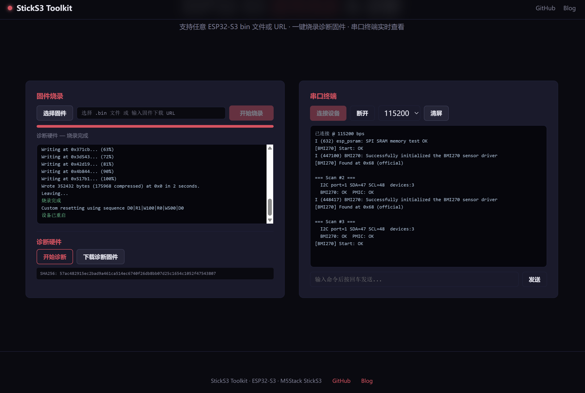
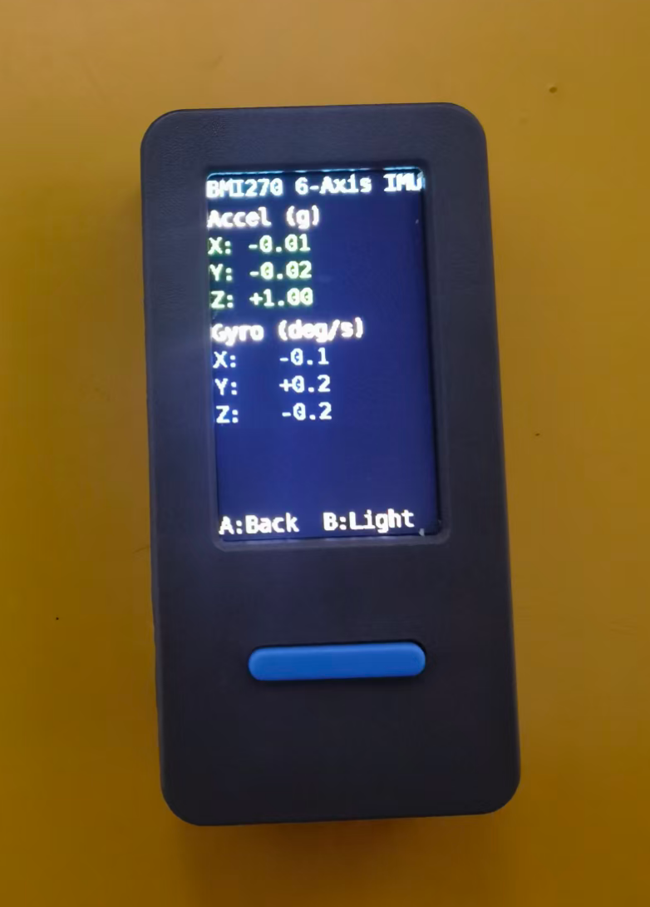

# StickS3 Toolkit

M5Stack StickS3 hardware diagnostics and firmware flashing toolset.  
[简体中文](README.md)

## Screenshots

| Web Flash | Device Screen |
|-----------|---------------|
|  |  |

## Features

- **I2C Bus Scanner** — auto-detects onboard I2C devices (PMIC, BMI270 IMU, etc.)
- **BMI270 6-Axis IMU** — real-time accelerometer (g) and gyroscope (deg/s) readings
- **M5PM1 Power Management** — automatic PMIC initialization and backlight control
- **Web Flasher** — browser-based USB flashing for any ESP32-S3 bin file
- **Serial Terminal** — Web Serial API for real-time device output

## Ports

| Service | Port |
|---------|------|
| StickS3 Toolkit Web Flash | 8997 |

## Quick Start

```bash
# Start web flash server
cd web-flash && python3 -m http.server 8997

# Build firmware
cd firmware && bash build.sh
```

## Hardware

| Component | Bus | Address/Pin |
|-----------|-----|-------------|
| M5PM1 PMIC | I2C | 0x6E |
| BMI270 IMU | I2C | 0x68 |
| ST7789 Display | SPI | MOSI=39, SCK=40, DC=45, CS=41, RST=21, BL=38 |
| Button A | GPIO | 11 |
| Button B | GPIO | 12 |
| I2C Bus | GPIO | SDA=47, SCL=48 |

## Controls

| Button | Function |
|--------|----------|
| A (front) | Rescan I2C bus |
| B (side) | Enter BMI270 6-axis live data view |

## Project Structure

```
sticks3-toolkit/
  firmware/          # ESP32-S3 firmware (ESP-IDF 5.5)
    main/
      main.cpp       # main loop, buttons, scan logic
      display.c/h    # ST7789 display driver
      pmic.c/h       # M5PM1 power management
      bmi270_wrap.c/h # BMI270 driver wrapper
      CMakeLists.txt
      sdkconfig.defaults
    build.sh          # build + merge + SHA256
  web-flash/
    index.html       # generic flasher + serial terminal
```

## Build Requirements

- ESP-IDF 5.5
- Chip: ESP32-S3
- Python 3.9+

## Links

- GitHub: https://github.com/whitefirer/sticks3-toolkit
- Blog: https://whitefirer.org
